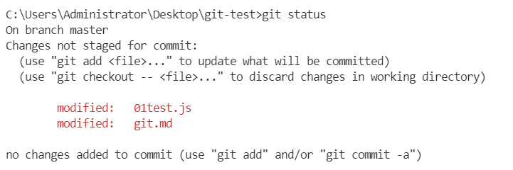
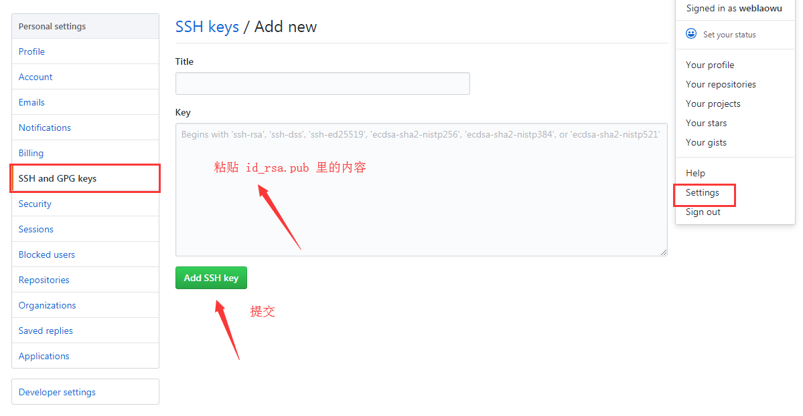
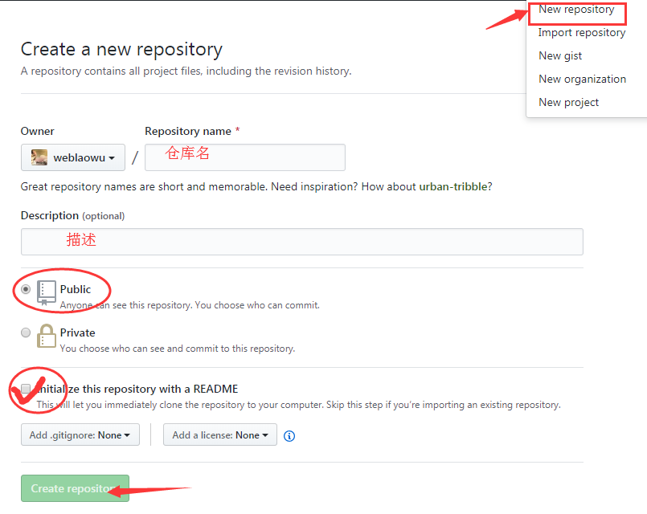

### git
##### 1、windows上直接下载git安装程序，安装成功
>1. 在菜单栏里找到 git -> Git Bash，运行程序会弹出一个命令行窗口(linux风格)，说明安装成功。
>2. 设置用户名和邮箱
 因为Git是分布式版本控制系统，所以，每个机器都必须自报家门：你的名字和Email地址
 注意 git config 命令的--global 参数，用了这个参数，表示你这台机器上所有的Git仓库都会使用这个配置，当然也可以对某个仓库指定不同的用户名和Email地址。
```js {.line-numbers}
// 指定用户名和邮箱
git config --global user.name "your name"
git config --global user.email "your email"
```
##### 2、创建版本库(repository) 
>- 版本库就是仓库，你可以简单理解成一个目录，这个目录里面的所有文件都可以被Git管理起来，每个文件的修改、删除，Git都能跟踪，以便任何时刻都可以追踪历史，或者在将来某个时刻可以还原。

>1. **git init：** 再本地新建一个文件夹，进入，通过git 
init命令把这个目录变成Git可以管理的仓库
```js {.line-numbers}
 // 新建 git-test 文件夹  
 cd git-test
 git init
```
>- (1) 这个时候你会发现当前目录下多了一个.git目录，这个目录是Git来跟踪管理版本库的，这里面文件不要随便修改最好，不然会破坏git仓库
>- (2) 如果你没有看到.git目录。你的目录被隐藏了，用 ls -ah 命令就可以看见

>2. **git add：**  接下来通过 git add 指令把文件添加到仓库 
   执行指令，没有信息就是成功了
```js {.line-numbers}
 // 在文件下新建一个 01test.js 并提交到暂存仓库
 touch 01test.js
 git add  01test.js 
```
>3. **git commit：** 用命令 git commit 把文件提交到仓库
   -m 后面输入的是本次提交的说明
```js {.line-numbers}
 git commit -m "this is first commit"
```
>4. **git status：** 这个命令可以让我们时刻掌握仓库当前的状态
```js {.line-numbers}
 // 比如修改 01test.js 内容
  const a  = 10;

 // 在输入命令
  git status 
```


##### 3、远程仓库 
>-  先的有一个github账号，由于你的本地Git仓库和GitHub仓库之间的传输是通过SSH加密的，所以需要一点设置：
> 1. 创建SSH Key，在用户主目录下，看看有没有.ssh目录，如果有，再看看这个目录下有没有id_rsa和id_rsa.pub这两个文件，如果已经有了，可直接跳到下一步。如果没有,需要创建SSH Key： 
```js {.line-numbers}
// 创建 SSH Key 
ssh-keygen -t rsa -C "your email"
```
>  2. 创建完成，会出现 .ssh 文件，文件中 id_rsa是私钥，不能泄露出去，id_rsa.pub是公钥,复制里面内容。
>  3. 登陆GitHub，打开 'Account settings' -> 'SSH Keys'页面 把刚才复制内容粘贴到 key 中, 点击 Add Key , 你就添加成功了



>  4. 现在你想把本地仓库和github上的仓库进行远程同步，这样github上的仓库既可以作为项目备份，也可以让别人看到。首先你必须得在github上新建一个仓库 


> 5. 关联远程仓库：**git remote add origin  github仓库地址**
```js {.line-numbers}
 // 回到 命令行窗口输入 origin就是远程库
 git remote add origin https://github.com/yourname/xxxx.git
 // 如果报错或者失败：如
 fatal: remote origin already exists.
 // 输入命令即可，重新设置 
 git remote rm origin 
```

> 6. **git push：** 把本地仓库的内容推送到远程仓库 
```js {.line-numbers} 
 // -u 会把本地的master分支和远程的master分支关联起来，之后可以简化命令
 git push -u origin master 
 // 如果报错：如
 error: failed to push some refs to "git@github.com:....." Updates were rejected 
 because the remote contains work that you do not have locally.
 // 意思是本地和远程的文件应该合并后才能上传本地的新文件

 // 先拉下来，会自动合并
 git pull origin master
 
 // 合并完成，再次push
 git push -u origin master 
```     